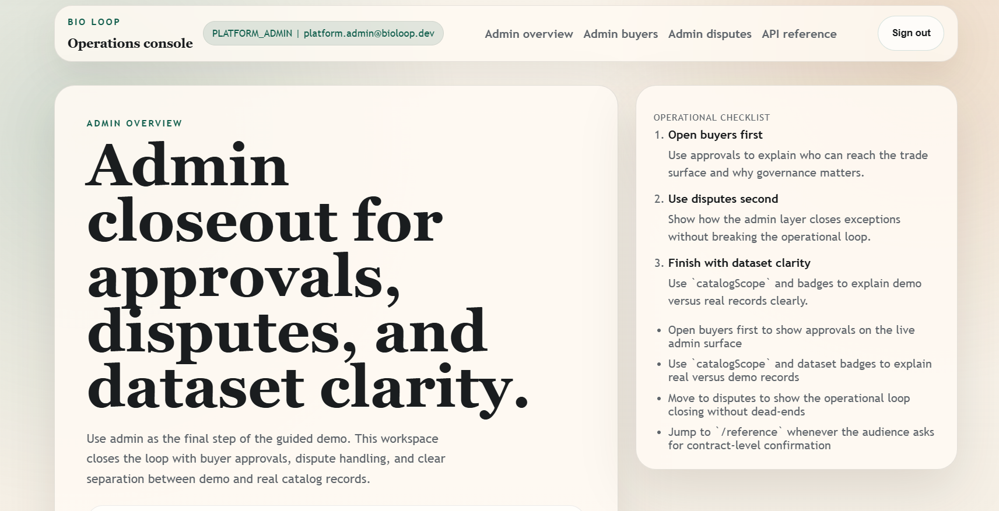

# Bio-Loop Orchestrator

A specialized B2B Marketplace for surplus inventory recovery, designed to monetize food waste through real-time, commodity-style trading.



## Overview

Bio-Loop is a production-oriented showcase of a vertical marketplace. It demonstrates the validated foundation of a surplus inventory platform, including buyer authentication, API-backed marketplace data, production readiness checks, and documented validation evidence. Seller and Admin workflows are still under validation.

## What the project does

Bio-Loop is a B2B marketplace prototype for surplus food inventory.

The system connects sellers who have surplus products with buyers looking for available opportunities. Sellers publish available inventory, buyers access a feed of active auctions or offers, and the platform manages authentication, role-based access, API data, and operational readiness.

The current validated production flow proves buyer login, buyer session, API-backed buyer feed, and production business data visibility. Seller and Admin workflows are still under validation.

### Key Validated Milestones (Production Smoke)
- **Buyer Login & Session:** PASS (httpOnly cookies + CSRF validation)
- **Buyer Feed:** PASS (real-time visibility of active auctions)
- **Data Integrity:** PASS (`source=api` verified, production business data visibility confirmed)
- **Infrastructure:** PASS (validated health, readiness, and reference endpoints)

*Note: Seller and Admin workflows are currently in validation phase.*

## Live Demo

- **Web App:** [https://bio-loop-orchestrator-web.vercel.app](https://bio-loop-orchestrator-web.vercel.app)
- **API Reference:** [https://bio-loop-orchestrator-production.up.railway.app/reference](https://bio-loop-orchestrator-production.up.railway.app/reference)

## Technical Evidence

- **API Base:** [https://bio-loop-orchestrator-production.up.railway.app](https://bio-loop-orchestrator-production.up.railway.app)
- **OpenAPI Schema:** [https://bio-loop-orchestrator-production.up.railway.app/openapi.json](https://bio-loop-orchestrator-production.up.railway.app/openapi.json)
- **Health Check:** [https://bio-loop-orchestrator-production.up.railway.app/health](https://bio-loop-orchestrator-production.up.railway.app/health)
- **Readiness Check:** [https://bio-loop-orchestrator-production.up.railway.app/readiness](https://bio-loop-orchestrator-production.up.railway.app/readiness)

## Architecture & Tech Stack

This repository demonstrates a production-oriented engineering approach with clear separation of concerns and high-performance standards.

- **Monorepo:** pnpm workspaces + Turborepo
- **Frontend:** Next.js 15 (React 19, TypeScript, Tailwind CSS)
- **Backend:** NestJS (TypeScript, Prisma ORM)
- **Persistence:** PostgreSQL
- **Security:** CSRF-aware auth flow, httpOnly session cookies, and role-based product areas.
- **Observability:** Structured logging, request-id tracking, and automated health checks.

## Local Development

### Prerequisites
- Node.js 24+
- pnpm
- Docker (for local database and cache)

### Setup
```bash
# Install dependencies
pnpm install

# Run Web App
pnpm --filter @bio-loop/web dev

# Run API
pnpm --filter @bio-loop/api dev
```

## Documentation

Detailed operational and technical documentation is available in the `docs/` directory:
- [Deployment Baseline](docs/deploy/deploy-baseline.md)
- [Production Readiness Review](docs/ops/PILOT_READINESS_REVIEW_B4-17.md)
- [Execution Status](docs/ops/STATUS.md)

---
Author: Ricardo Souza
